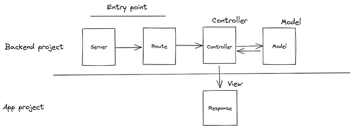

# MVC pattern
See [this blog by Jon Oyanguren Lopez](https://medium.com/@jonoyanguren/mvc-pattern-in-nodejs-and-express-old-but-gold-46c21bee365a).

In a simple API, you'll have your app.js, index.js or server.js (your entrypoint) in the root, and then 3 additional folders:
- models
    - holds all the interactions with databases.
- routes
    - One router file per base path / **entity** (e.g. /books, /books/:id, etc. all go in one file).
    - For each possiblity, the router file simply defines the path that is matched, the method (like get, post, etc.), and a callback function (the controller).
- controllers
    - the router passes the request to a controller. The controller communicates with the models, does a bunch of stuff, and sends a response (or renders a view).



You can have your project organized in two ways:
1. Have all your routes in one `routes` folder, all your models in one `models` folder, all controllers in one `controller` folder.

    Example:
    ```
    express-app-1/
    ├─ models/
    │  ├─ db.js
    ├─ errors/
    │  ├─ CustomNotFoundError.js
    ├─ controllers/
    │  ├─ authorController.js
    │  ├─ ... other controllers
    ├─ routes/
    │  ├─ authorRouter.js
    │  ├─ ... other routers
    ├─ app.js
    ```
2. Have one folder per entity, which holds the route, model and controller for that entity.

    Example:
    ```
    express-app-2/
    ├─ area/
    │  ├─ ...
    ├─ auth/
    │  ├─ ...
    ├─ reservation/
    │  ├─ reservation.controller.js
    │  ├─ reservation.model.js
    │  ├─ reservation.routes.js
    ├─ user/
    │  ├─ ...
    ├─ vehicle/
    │  ├─ ...
    ├─ app.js
    ```
